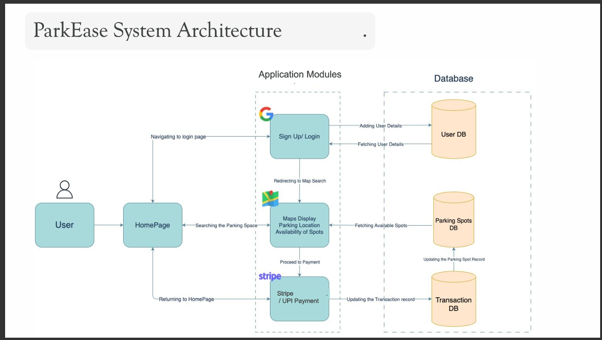
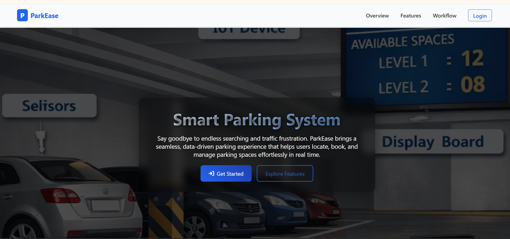
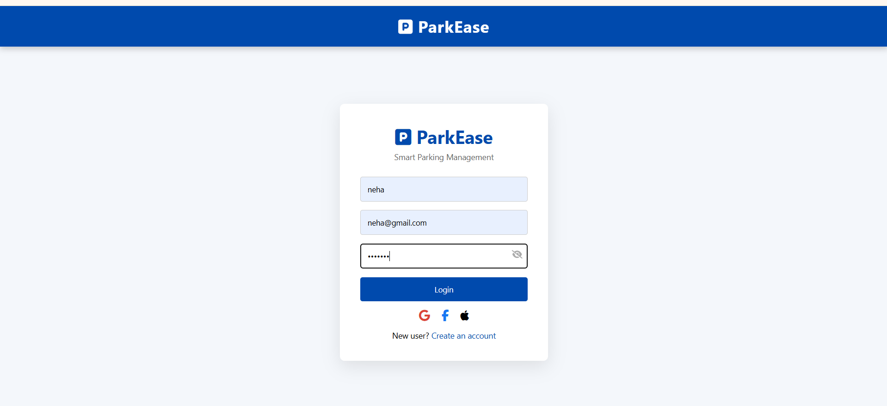
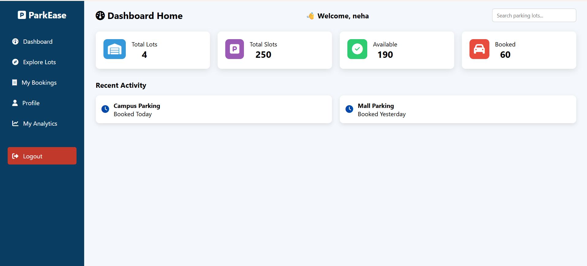
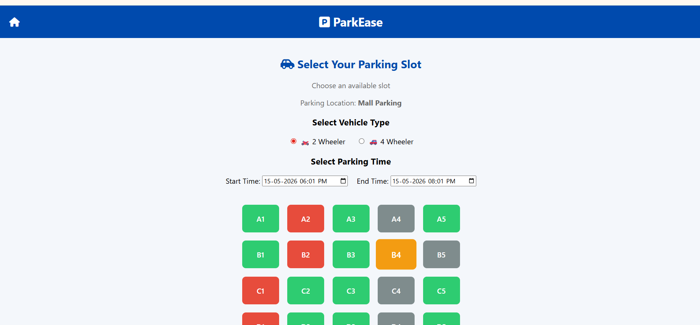

# ParkEase - Smart Parking System

# Live Demo

Coming Soon

A full-stack smart parking management system built using React, Node.js, Express.js, and MySQL.

ParkEase helps users search, book, and manage parking slots efficiently through an interactive web application. The system improves parking management by providing parking availability, booking functionality, authentication, and payment integration.

---

# Features

- User Registration and Login
- JWT Authentication
- Parking Slot Availability
- Slot Booking System
- Google Maps Integration
- Stripe / UPI Payment Module
- Booking Management
- Responsive User Interface
- Admin Dashboard

---

# System Architecture



---

# Screenshots

## Home Page


## Login Page


## Dashboard


## Booking Page


---

# Tech Stack

## Frontend
- React.js
- Chakra UI
- Bootstrap
- Material UI
- TypeScript

## Backend
- Node.js
- Express.js

## Database
- MySQL

## Authentication
- JWT
- bcryptjs

## APIs & Integrations
- Google Maps API
- Stripe API

---

# Installation

## Clone Repository

```bash
git clone https://github.com/Anusha268A/ParkEase-Smart-Parking-System.git
```

---

# Project Structure

frontend/ → React frontend  
backend/ → Express backend  
assets/ → Screenshots and architecture images

## Install Frontend Dependencies

```bash
cd frontend
npm install
```

---

## Start Frontend

```bash
npm start
```

---

## Install Backend Dependencies

```bash
cd backend
npm install
```

---

## Start Backend

```bash
npm start
```

---

# Future Enhancements

- Real-time slot tracking
- QR-based parking access
- AI-based parking prediction
- Email notifications

---

# Author

Anusha Ajmeera
